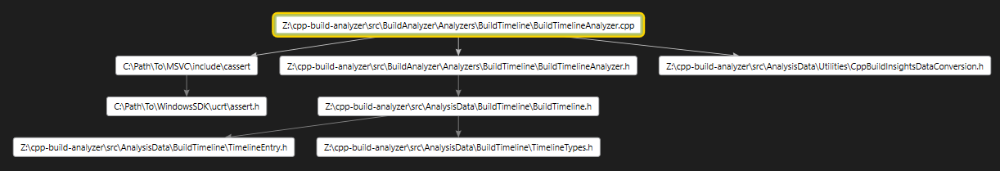
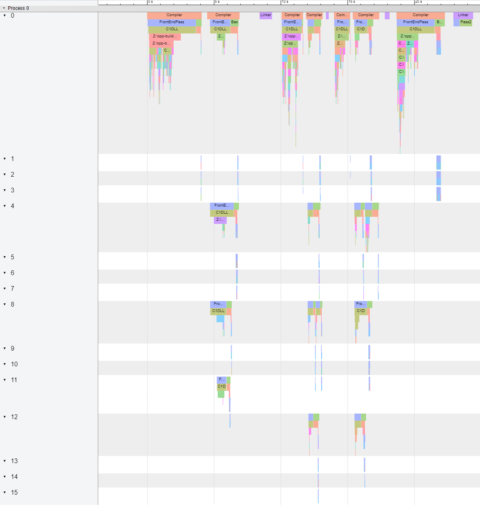
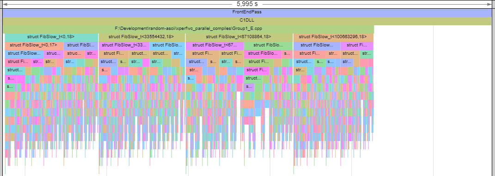

# C++ Build Analyzer

Leverage C++ Build Insights SDK to get interesting data from your builds.

## Features

  * Lists file compilation times (`.csv`).
  * Lists file inclusion times (`.csv`).
  * Lists function compilation times (`.csv`).
  * Generates file inclusion graphs (`.dgml`):
    
  * Generates flame graphs out of build execution (`.json`):
    
    * Also processes template instantiations, if present:
      

### Examples

  * [File inclusion graph for `CppBuildAnalyzer`](./readme-samples/FileInclusionGraph.dgml) (edited to cut paths down).
  * [Flame graph for `CppBuildAnalyzer`](./readme-samples/BuildTimeline.json) (edited to cut paths down). Open in Google Chrome trace viewer ([chrome://tracing](chrome://tracing)).

## Getting started

Requisites:

  * Install Visual Studio 2019 Community Edition.
  * Clone and build [vcperf](https://github.com/microsoft/vcperf).
  * Clone and build this repository.

To collect a trace:

  * Open an elevated command prompt pointing to vcperf.
  * Execute `vcperf /start SomeSessionName`.
    * If you want full data (including template intantiations) execute `vcperf /start /level3 SomeSessionName` instead.
  * Build your Visual Studio 2017+ project from Visual Studio or command line.
  * Execute `vcperf /stopnoanalyze SomeSessionName TraceFile.etl`.

To analyze a trace:

  * Open a command prompt.
  * Execute `CppBuildAnalyzer -i TraceFile.etl --analyze_all`.

## Command line options

**Required**:

    -i, --input arg                        Path to trace file
        --analyze_all                      Perform all analysis the program can do

**Optional**:
    
    -h, --help                             Show help
    
        --analyze_function_compilations    Analyzes function compilations (i.e. how long did each one take)
        --analyze_file_inclusion_times     Analyzes file inclusion times (i.e. how long did each one take)
        --analyze_file_inclusion_graph     Creates a file inclusion graph (i.e. directed graph from include clauses)
        --analyze_file_compilations        Analyzes file compilations (i.e. how long did front-end and back-end take)
        --analyze_build_timeline           Analyzes trace and creates a timeline from it

        --out_function_compilations arg    Path to output function compilations data
        --out_file_inclusion_times arg     Path to output file inclusion times
        --out_file_inclusion_graph arg     Path to output file inclusion graph
        --out_file_compilations arg        Path to output file compilations data
        --out_build_timeline arg           Path to output build timeline

## License

This project is released under [GNU GPLv3](https://github.com/MetanoKid/cpp-build-analyzer/blob/master/LICENSE.md) license.

I started this project thanks to the information I gathered from the community, so I wanted to give something back. You are encouraged to alter it in any way you want, but please continue making it public so the community can benefit from it.

## Acknowledgements

Thanks to Microsoft's C++ Team and [@KevinCadieuxMS](https://twitter.com/KevinCadieuxMS) in particular for the C++ Build Insights SDK and [vcperf](https://github.com/microsoft/vcperf)!
